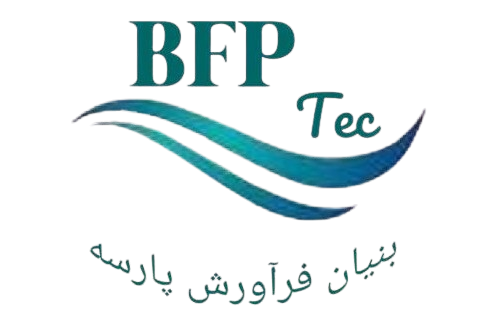

<a id="readme-top"></a>

[![Contributors][contributors-shield]][contributors-url]
[![Forks][forks-shield]][forks-url]
[![Stargazers][stars-shield]][stars-url]
[![Issues][issues-shield]][issues-url]
[![Unlicense License][license-shield]][license-url]
[![LinkedIn][linkedin-shield]][linkedin-url]

<!-- PROJECT LOGO -->
<br />
<div align="center">
  <a href="https://github.com/bfptec/bfptec">
    
  </a>

  <h3 align="center">Bfptec</h3>

  <p align="center">
    a full-stack blogging platform. 
    <br />
    <br />
    <a href="https://bfptec.jsclimber.ir/">View Demo</a>
  </p>
</div>

<!-- TABLE OF CONTENTS -->
<details>
  <summary>Table of Contents</summary>
  <ol>
    <li>
      <a href="#about-the-project">About The Project</a>
      <ul>
        <li><a href="#tech-stack">Tech Stack</a></li>
      </ul>
    </li>
    <li>
      <a href="#getting-started">Getting Started</a>
      <ul>
        <li><a href="#prerequisites">Prerequisites</a></li>
        <li><a href="#installation">Installation</a></li>
      </ul>
    </li>
    <li><a href="#usage">Usage</a></li>
    <li><a href="#roadmap">Roadmap</a></li>
    <li><a href="#contributing">Contributing</a></li>
    <li><a href="#license">License</a></li>
    <li><a href="#contact">Contact</a></li>
    <li><a href="#acknowledgments">Acknowledgments</a></li>
  </ol>
</details>

<!-- ABOUT THE PROJECT -->

## About The Project

[![Product Name Screen Shot][product-screenshot]](https://bfptec.jsclimber.ir/)

Bfptec is a full-stack blogging platform focused on water and wastewater purification technologies. It features a modern UI, a comprehensive admin panel, and robust data management capabilities. Powered by Next.js 15, the application leverages React, Shadcn UI, and other cutting-edge technologies to deliver an intuitive user experience.

<p align="right">(<a href="#readme-top">back to top</a>)</p>

## Tech Stack

### Frontend

- [![React.js][React.js]][React-url]
- [![Tailwind CSS][Tailwind.css]][Tailwind-url]
- [![TypeScript][TypeScript]][TypeScript-url]

### Backend

- [![Next.js][Next.js]][Next-url]
- [![Payload CMS][Payload]][Payload-url]

### Database

- [![MongoDB][MongoDB]][MongoDB-url]

<p align="right">(<a href="#readme-top">back to top</a>)</p>

<!-- GETTING STARTED -->

## Getting Started

Follow these steps to set up the project locally.

### Prerequisites

Make sure you have the following installed on your machine:

- **Node.js**: Version `^18.20.2 || >=20.9.0` is required. Use [nvm](https://github.com/nvm-sh/nvm) to manage Node.js versions:
  ```sh
  nvm install 20.9.0
  nvm use 20.9.0
  ```

### Installation

1.  Clone the repo
    ```sh
    git clone https://github.com/bfptec/bfptec.git
    ```
2.  Navigate to the project directory:
    ```sh
    cd bfptec
    ```
3.  Install NPM packages
    ```sh
    npm install
    ```
4.  Configure environment variables:

    - Create a .env file in the root directory
    - Add the following variables:

    ```sh
    DATABASE_URL=mongodb+srv://<username>:<password>@cluster.mongodb.net/bfptec
    NEXT_PUBLIC_SITE_URL=https://bfptec.example.com
    PAYLOAD_SECRET=your-secret-key
    ```

5.  Build and Run
    ```sh
    npm run build
    npm start
    ```

<p align="right">(<a href="#readme-top">back to top</a>)</p>

<!-- USAGE EXAMPLES -->

## CI/CD

The deployment process is fully automated using **GitHub webhooks** and a custom **Bash script**. This ensures reliable, consistent, and efficient deployments to the production environment.

### How It Works

1. **Webhook Setup**  
   A GitHub webhook is configured to trigger on every `git push` to the `main` branch. This webhook sends a notification to the server to initiate the deployment process.

2. **Deployment Script Execution**  
   Once the webhook triggers, the server runs a Bash script that handles the following tasks:
   - **Repository Copy:**  
     Copies the repository to a temporary build path to ensure a clean build environment.
   - **Pull Latest Changes:**  
     Pulls the latest updates from the `main` branch to ensure the deployment is up to date.
   - **Dependency Installation:**  
     Installs required dependencies using `npm install` for the project.
   - **Build Process:**  
     Builds the project using the `npm run build` command to create a production-ready version.
   - **File Synchronization:**  
     Syncs the build files to the live server directory using `rsync` for efficient file transfers.
   - **Application Restart:**  
     Restarts the application using **PM2** to apply the latest changes seamlessly.

### Advantages

- **Reliability:** Each deployment follows a consistent process, minimizing the chance of errors.
- **Automation:** The use of GitHub webhooks and a Bash script eliminates manual intervention.
- **Efficiency:** Only updated files are synchronized, reducing downtime and resource usage.
- **Scalability:** The pipeline can be adapted for staging, testing, or additional environments as needed.

### Example Bash Script (Simplified)

See `deploy.sh` for more information.

## Contributing

his application is a blogging website featuring an admin panel for managing posts, pages, media, and more. Below are key usage instructions:

- Admin Panel: Use the admin panel to create and manage blog posts and pages.
- Dynamic Routing: Blog posts and pages are served with optimized SEO configurations.
- Media Uploads: Upload and manage images and files through the admin interface.

Note: This project does not have separate documentation. Refer to this README for guidance.

<p align="right">(<a href="#readme-top">back to top</a>)</p>

<!-- ROADMAP -->

## Roadmap

Roadmap

- [x] Add blogging functionality with an admin panel.
- [ ] Extend the Bfptec blogging website into a virtual water and wastewater lab.

<p align="right">(<a href="#readme-top">back to top</a>)</p>

<!-- CONTRIBUTING -->

## Contributing

Contributions are what make the open source community such an amazing place to learn, inspire, and create. Any contributions you make are **greatly appreciated**.

If you have a suggestion that would make this better, please fork the repo and create a pull request. You can also simply open an issue with the tag "enhancement".
Don't forget to give the project a star! Thanks again!

1. Fork the Project
2. Create your Feature Branch (`git checkout -b feature/AmazingFeature`)
3. Commit your Changes (`git commit -m 'Add some AmazingFeature'`)
4. Push to the Branch (`git push origin feature/AmazingFeature`)
5. Open a Pull Request

### Top contributors:

<a href="https://github.com/bfptec/bfptec/graphs/contributors">
  
</a>

<p align="right">(<a href="#readme-top">back to top</a>)</p>

<!-- LICENSE -->

## License

Distributed under the Unlicense License. See `LICENSE.txt` for more information.

<p align="right">(<a href="#readme-top">back to top</a>)</p>

<!-- CONTACT -->

## Contact

Amir Aryan - [@amiraryan1996](https://github.com/amiraryan1996) - amir.aryan.dv@gmail.com

Project Link: [https://github.com/bfptec/bfptec/](https://github.com/bfptec/bfptec/)

<p align="right">(<a href="#readme-top">back to top</a>)</p>

<!-- ACKNOWLEDGMENTS -->

## Acknowledgments

Here are some resources that helped shape this project. Thanks to all the amazing tools and communities that make development easier and more efficient:

- [React](https://react.dev) - A JavaScript library for building user interfaces.
- [Next.js](https://nextjs.org) - A React framework for building modern web applications.
- [Payload CMS](https://payloadcms.com) - A powerful headless CMS for managing content.
- [Shadcn UI](https://ui.shadcn.com) - A library of prebuilt and customizable UI components.
- [MongoDB](https://www.mongodb.com) - A NoSQL database for scalable and flexible data storage.
- [Tailwind CSS](https://tailwindcss.com) - A utility-first CSS framework for rapid UI development.
<p align="right">(<a href="#readme-top">back to top</a>)</p>

<!-- MARKDOWN LINKS & IMAGES -->
<!-- https://www.markdownguide.org/basic-syntax/#reference-style-links -->

[product-screenshot]: public/images/screenshot.png
[Next.js]: https://img.shields.io/badge/next.js-000000?style=for-the-badge&logo=nextdotjs&logoColor=white
[Next-url]: https://nextjs.org/
[React.js]: https://img.shields.io/badge/React-20232A?style=for-the-badge&logo=react&logoColor=61DAFB
[React-url]: https://reactjs.org/
[Payload]: https://img.shields.io/badge/Payload%20CMS-000000?style=for-the-badge&logo=payloadcms&logoColor=white
[Payload-url]: https://payloadcms.com/
[MongoDB]: https://img.shields.io/badge/MongoDB-47A248?style=for-the-badge&logo=mongodb&logoColor=white
[MongoDB-url]: https://www.mongodb.com/
[Tailwind.css]: https://img.shields.io/badge/Tailwind_CSS-38B2AC?style=for-the-badge&logo=tailwind-css&logoColor=white
[Tailwind-url]: https://tailwindcss.com/
[TypeScript]: https://img.shields.io/badge/TypeScript-007ACC?style=for-the-badge&logo=typescript&logoColor=white
[TypeScript-url]: https://www.typescriptlang.org/
[linkedin-url]: https://linkedin.com/in/amiraryan1996
[linkedin-shield]: https://img.shields.io/badge/-LinkedIn-black.svg?style=for-the-badge&logo=linkedin&colorB=555
[contributors-shield]: https://img.shields.io/github/contributors/bfptec/bfptec.svg?style=for-the-badge
[contributors-url]: https://github.com/bfptec/bfptec/graphs/contributors
[forks-shield]: https://img.shields.io/github/forks/bfptec/bfptec.svg?style=for-the-badge
[forks-url]: https://github.com/bfptec/bfptec/network/members
[stars-shield]: https://img.shields.io/github/stars/bfptec/bfptec.svg?style=for-the-badge
[stars-url]: https://github.com/bfptec/bfptec/stargazers
[issues-shield]: https://img.shields.io/github/issues/bfptec/bfptec.svg?style=for-the-badge
[issues-url]: https://github.com/bfptec/bfptec/issues
[license-shield]: https://img.shields.io/github/license/bfptec/bfptec.svg?style=for-the-badge
[license-url]: https://github.com/bfptec/bfptec/blob/master/LICENSE.txt
